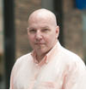
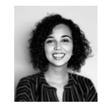

# Meet Your Faculty

#### Guillaume Bourque

>Professor, McGill University  
Director of Bioinformatics, Genome Quebec Innovation Centre  
Director, Canadian Centre of Computational Genomics  
Director, McGill initiative for Computational Medicine  
>

Dr. Bourque research interests are in comparative and functional
genomics with a special emphasis on applications of next-generation sequencing technologies.
His lab develops advanced tools and scalable computational infrastructure to enable large-scale
applied research projects.

#### Martin Hirst

>Distinguished Scientist, BC Cancer  
Professor, Department of Microbiology & Immunology  
Director, Michael Smith Laboratories  
Michael Smith Laboratories
>

Dr. Hirst’s research focuses on understanding epigenetic dysfunction in
cancer and his laboratory develops experimental and computational tools to characterize normal
and transformed cell types down to the single cell level. He applies these tools to explore the
epigenomic states of normal and transformed cell types to discover and exploit therapeutic
vulnerabilities.

#### David Bujold

>Bioinformatics Manager, Data Unit  
Canadian Centre of Computational Genomics
>

He joined the McGill Epigenomic Data Coordination Center at McGill in
2012 to tackle challenges related to epigenomics, and has since developed
many data management and discovery solutions, including the IHEC Data Portal. Other projects
of interest include CanDIG and EpiShare, platforms to make genomic and epigenomic data
under controlled access more accessible, while maintaining study participants’ privacy.

#### Jose Hector Galvez

>Bioinformatics Manager, Tech Dev Unit  
Canadian Centre of Computational Genomics
>

As a Bioinformatics Specialist in the Research and Development team,
Jose Hector is involved in maintaining, documenting, and upgrading
the RNA-seq pipelines in GenPipes. He also collaborates in several research projects, mostly
focusing on transcriptomics, genome assembly, and epigenomics.

#### Edmund Su

>Bioinformatician  
Ontario Institute for Cancer Research
>

Edmund is a bioinformatician within the genome informatics team at OICR,
where he provides technical knowledge and expertise in genomic analysis.
His main focus is developing pipelines and data wrangling for ICGC-ARGO
(International Cancer Genome Consortium - Accelerating Research in Genomic Oncology).

#### BF Francis Ouellette

>Scientific Director  
Canadian Bioinformatics Workshops (CBW)  
Montreal, QC, CA  
>
> --- francis@bioinformatics.ca

Francis was one of the co-founders of the CBW in 1998. His teams
were involved in the development of high throughput sequence analysis methods, as well as the
development of platforms to integrate data from various open databases. Francis continues to
be interested in computational biology and genomics, and the integration of all data types to
help our understanding of biology.

#### Rachade Hmamouchi

>Program Manager  
Canadian Bioinformatics Workshops (CBW)  
Montreal, QC, CA
>
> --- rachade@bioinformatics.ca

As a Program Manager, Rachade is leading the organization of current
workshop series as well as the development of new ones. She
contributes to the development and implementation of promotional
strategies too. Rachade has a background in bioinformatics and project management working in
academic and industrial research. She holds an MSc degree in bioinformatics and data analysis
from the University of Geneva.
