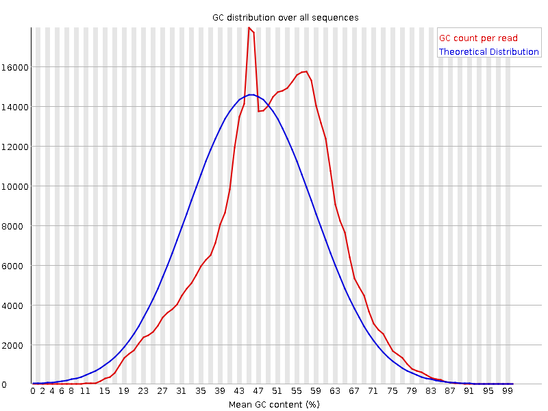

# (PART) Modules {-}

# Module 1: Introduction to ChIP Sequencing and Analysis

## Lecture

<iframe src="https://drive.google.com/file/d/1JOF-Ri0mvZDfeL2k3ayEs2WqS3ZkBd0e/preview" width="640" height="480" allow="autoplay"></iframe>

## Lab

### Common Tools of the Trade

#### Explaination of Tools

[BWA](http://bio-bwa.sourceforge.net/bwa.shtml) Genomic Sequence Read alignment tool

[PICARD](https://broadinstitute.github.io/picard/) Toolkit for BAM file manipulation

[SAMTOOLS](http://www.htslib.org/doc/samtools.html) Toolkit for BAM file manipulation

[BEDTOOLSToolkit](https://bedtools.readthedocs.io/en/latest/index.html) for BED/BEDGRAPH file manipulation

[MACS2](https://github.com/macs3-project/MACS) Enriched region identifier for ChIP-seq

[UCSCtools])(http://genome.ucsc.edu/goldenPath/help/bigWig.html) Manipulation of Wigs and Bed/Bedgraph to binary forms

#### Resource Files

1. BWA INDEX:
  - ~/CourseData/EPI_data/Module1/BWA_index/

2. Enhancer file.bed:
  - ~/CourseData/EPI_data/Module1/QC_resources/
  - download various state7 and merge https://egg2.wustl.edu/roadmap/data/byFileType/chromhmmSegmentations/ChmmModels/coreMarks/jointModel/final/

3. TSS.bed:
  - ~/CourseData/EPI_data/Module1/QC_resources/
  - Generated by downloading Ensemblv79 GTF convert to Bed +/-2kb of TSS. See https://www.biostars.org/p/56280/

4. HOX regions.bed
  - ~/CourseData/EPI_data/Module1/QC_resources/
  - Generated by downloading Ensemblv79 GTF convert to Bed then selecting for HOX

  Hg38 Black list regions
    - ~/CourseData/EPI_data/Module1/QC_resources/
    - https://www.encodeproject.org/files/ENCFF356LFX/@@download/ENCFF356LFX.bed.gz

#### Resource Files

1. CEMT Pooled Breast Basal

  - ~/CourseData/EPI_data/Module1/CHEERC_resources
  - https://epigenomesportal.ca/tracks/CEEHRC/hg38/69069.CEEHRC.CEMT0035.H3K27ac.peak_calls.bigBed

2. CEMT Pooled Breast Basal

  - https://epigenomesportal.ca/tracks/CEEHRC/hg38/69067.CEEHRC.CEMT0035.H3K27ac.signal_unstranded.bigWig

3. CEMT Pooled Breast Basal

  - ~/CourseData/EPI_data/Module1/CHEERC_resources
https://epigenomesportal.ca/tracks/CEEHRC/hg38/69063.CEEHRC.CEMT0035.H3K27me3.peak_calls.bigBed

4. CEMT Pooled Breast Basal

  - https://epigenomesportal.ca/tracks/CEEHRC/hg38/69061.CEEHRC.CEMT0035.H3K27me3.signal_unstranded.bigWig

5. CEMT Pooled Breast Basal

  - ~/CourseData/EPI_data/Module1/CHEERC_resources
https://epigenomesportal.ca/tracks/CEEHRC/hg38/69054.CEEHRC.CEMT0035.H3K4me1.peak_calls.bigBed

6. CEMT Pooled Breast Basal

  - https://epigenomesportal.ca/tracks/CEEHRC/hg38/69052.CEEHRC.CEMT0035.H3K4me1.signal_unstranded.bigWig

7. CEMT Pooled Breast Basal

  - ~/CourseData/EPI_data/Module1/CHEERC_resources
https://epigenomesportal.ca/tracks/CEEHRC/hg38/69057.CEEHRC.CEMT0035.H3K4me3.peak_calls.bigBed

8. CEMT Pooled Breast Basal

  - https://epigenomesportal.ca/tracks/CEEHRC/hg38/69055.CEEHRC.CEMT0035.H3K4me3.signal_unstranded.bigWig

9. CEMT Pooled Breast Basal

  - https://epigenomesportal.ca/tracks/CEEHRC/hg38/69070.CEEHRC.CEMT0035.Input.signal_unstranded.bigWig

10. CEMT Pooled Breast Stromal

  - ~/CourseData/EPI_data/Module1/CHEERC_resources
  - https://epigenomesportal.ca/tracks/CEEHRC/hg38/69088.CEEHRC.CEMT0036.H3K27ac.peak_calls.bigBed

11. CEMT Pooled Breast Stromal

  - https://epigenomesportal.ca/tracks/CEEHRC/hg38/69086.CEEHRC.CEMT0036.H3K27ac.signal_unstranded.bigWig

12. CEMT Pooled Breast Stromal

  - ~/CourseData/EPI_data/Module1/CHEERC_resources
  - https://epigenomesportal.ca/tracks/CEEHRC/hg38/69082.CEEHRC.CEMT0036.H3K27me3.peak_calls.bigBed

13. CEMT Pooled Breast Stromal

  - https://epigenomesportal.ca/tracks/CEEHRC/hg38/69080.CEEHRC.CEMT0036.H3K27me3.signal_unstranded.bigWig

14. CEMT Pooled Breast Stromal

  - ~/CourseData/EPI_data/Module1/CHEERC_resources
  - https://epigenomesportal.ca/tracks/CEEHRC/hg38/69073.CEEHRC.CEMT0036.H3K4me1.peak_calls.bigBed

15. CEMT Pooled Breast Stromal

  - https://epigenomesportal.ca/tracks/CEEHRC/hg38/69071.CEEHRC.CEMT0036.H3K4me1.signal_unstranded.bigWig

16. CEMT Pooled Breast Stromal

  - ~/CourseData/EPI_data/Module1/CHEERC_resources
  - https://epigenomesportal.ca/tracks/CEEHRC/hg38/69076.CEEHRC.CEMT0036.H3K4me3.peak_calls.bigBed

17. CEMT Pooled Breast Stromal

  - https://epigenomesportal.ca/tracks/CEEHRC/hg38/69074.CEEHRC.CEMT0036.H3K4me3.signal_unstranded.bigWig

18. CEMT Pooled Breast Stromal

  - https://epigenomesportal.ca/tracks/CEEHRC/hg38/69089.CEEHRC.CEMT0036.Input.signal_unstranded.bigWig

19. CEMT Pooled Breast Luminal

  - ~/CourseData/EPI_data/Module1/CHEERC_resources
  - https://epigenomesportal.ca/tracks/CEEHRC/hg38/69107.CEEHRC.CEMT0037.H3K27ac.peak_calls.bigBed

20. CEMT Pooled Breast Luminal

  - https://epigenomesportal.ca/tracks/CEEHRC/hg38/69105.CEEHRC.CEMT0037.H3K27ac.signal_unstranded.bigWig

21. CEMT Pooled Breast Luminal

  - ~/CourseData/EPI_data/Module1/CHEERC_resources
  - https://epigenomesportal.ca/tracks/CEEHRC/hg38/69101.CEEHRC.CEMT0037.H3K27me3.peak_calls.bigBed

22. CEMT Pooled Breast Luminal

  - https://epigenomesportal.ca/tracks/CEEHRC/hg38/69099.CEEHRC.CEMT0037.H3K27me3.signal_unstranded.bigWig

23. CEMT Pooled Breast Luminal

  - ~/CourseData/EPI_data/Module1/CHEERC_resources
  - https://epigenomesportal.ca/tracks/CEEHRC/hg38/69092.CEEHRC.CEMT0037.H3K4me1.peak_calls.bigBed

24. CEMT Pooled Breast Luminal

  - https://epigenomesportal.ca/tracks/CEEHRC/hg38/69090.CEEHRC.CEMT0037.H3K4me1.signal_unstranded.bigWig

25. CEMT Pooled Breast Luminal

  - ~/CourseData/EPI_data/Module1/CHEERC_resources
  - https://epigenomesportal.ca/tracks/CEEHRC/hg38/69095.CEEHRC.CEMT0037.H3K4me3.peak_calls.bigBed

26. CEMT Pooled Breast Luminal

  - https://epigenomesportal.ca/tracks/CEEHRC/hg38/69093.CEEHRC.CEMT0037.H3K4me3.signal_unstranded.bigWig

27. CEMT Pooled Breast Luminal

  - https://epigenomesportal.ca/tracks/CEEHRC/hg38/69108.CEEHRC.CEMT0037.Input.signal_unstranded.bigWig

28. CEMT Pooled Breast Luminal Progenitor

  - ~/CourseData/EPI_data/Module1/CHEERC_resources
  - https://epigenomesportal.ca/tracks/CEEHRC/hg38/69126.CEEHRC.CEMT0038.H3K27ac.peak_calls.bigBed

29. CEMT Pooled Breast Luminal Progenitor

  - https://epigenomesportal.ca/tracks/CEEHRC/hg38/69124.CEEHRC.CEMT0038.H3K27ac.signal_unstranded.bigWig

30. CEMT Pooled Breast Luminal Progenitor

  - ~/CourseData/EPI_data/Module1/CHEERC_resources
  - https://epigenomesportal.ca/tracks/CEEHRC/hg38/69120.CEEHRC.CEMT0038.H3K27me3.peak_calls.bigBed

31. CEMT Pooled Breast Luminal Progenitor

  - https://epigenomesportal.ca/tracks/CEEHRC/hg38/69118.CEEHRC.CEMT0038.H3K27me3.signal_unstranded.bigWig

32. CEMT Pooled Breast Luminal Progenitor

  - ~/CourseData/EPI_data/Module1/CHEERC_resources
  - https://epigenomesportal.ca/tracks/CEEHRC/hg38/69111.CEEHRC.CEMT0038.H3K4me1.peak_calls.bigBed

33. CEMT Pooled Breast Luminal Progenitor

  - https://epigenomesportal.ca/tracks/CEEHRC/hg38/69109.CEEHRC.CEMT0038.H3K4me1.signal_unstranded.bigWig

34. CEMT Pooled Breast Luminal Progenitor

  - ~/CourseData/EPI_data/Module1/CHEERC_resources
  - https://epigenomesportal.ca/tracks/CEEHRC/hg38/69114.CEEHRC.CEMT0038.H3K4me3.peak_calls.bigBed

35. CEMT Pooled Breast Luminal Progenitor

  - https://epigenomesportal.ca/tracks/CEEHRC/hg38/69112.CEEHRC.CEMT0038.H3K4me3.signal_unstranded.bigWig

36. CEMT Pooled Breast Luminal Progenitor

  - https://epigenomesportal.ca/tracks/CEEHRC/hg38/69127.CEEHRC.CEMT0038.Input.signal_unstranded.bigWig

### Module 1. BWA Alignment + BAM Post-processing

1. Have a genome reference file ready (DONE)
2. Index genome reference file (DONE)
3. Run quality Check
4. Run alignment
5. Coordinate Sort alignment File
6. Duplicate marking alignment
7. Flagstats
7. Clean up

#### Setup
```{}
mkdir ~/workspace/{alignments,fastqc}
```

##### 1. Make a reference directory and download appropriate fasta reference @ https://hgdownload.cse.ucsc.edu/goldenpath/ (https://hgdownload.soe.ucsc.edu/goldenPath/hg38/bigZips/hg38.fa.gz). For the live tutorial this step was done for you. We will be using a shortened version containining only chr19

Code:
```{}
mkdir ~/CourseData/BWA_index
wget https://hgdownload.soe.ucsc.edu/goldenPath/hg38/bigZips/hg38.fa.gz -O ~/CourseData/BWA_index/
gunzip ~/CourseData/EPI_data/Module1/BWA_index/hg38.fa.gz
```

##### 2 .Index Fasta using BWA. For the live tutorial, this step was done for you.

Code:
```{}
bwa index ~/CourseData/EPI_data/Module1/BWA_index/chr19.hg38_no_alt.fa
ls ~/CourseData/EPI_data/Module1/BWA_index/ -lth
```

Output:
```{}
total 155M
8126488 -rw-rw-r-- 1 ubuntu ubuntu 28M Sep  7 19:22 chr19.hg38_no_alt.fa.sa
8126486 -rw-rw-r-- 1 ubuntu ubuntu 108 Sep  7 19:22 chr19.hg38_no_alt.fa.amb
8126485 -rw-rw-r-- 1 ubuntu ubuntu 153 Sep  7 19:22 chr19.hg38_no_alt.fa.ann
8126484 -rw-rw-r-- 1 ubuntu ubuntu 14M Sep  7 19:22 chr19.hg38_no_alt.fa.pac
8126487 -rw-rw-r-- 1 ubuntu ubuntu 56M Sep  7 19:22 chr19.hg38_no_alt.fa.bwt
8126483 -rw-rw-r-- 1 ubuntu ubuntu 57M Sep  7 18:36 chr19.hg38_no_alt.fa
```

##### 3. Run Quality Check

Code:
```{}
mkdir -p ~/workspace/fastqc
fastq_file_A=~/CourseData/EPI_data/Module1/MCF10A_resources/R1_input.fastq.gz
fastq_file_B=~/CourseData/EPI_data/Module1/MCF10A_resources/R1_h3k27ac.fastq.gz
fastqc ${fastq_file_A} -o ~/workspace/fastqc
fastqc ${fastq_file_B} -o ~/workspace/fastqc
```

Output:
```{}
Started analysis of R1_input.fastq.gz
Approx 5% complete for R1_input.fastq.gz
Approx 10% complete for R1_input.fastq.gz
Approx 15% complete for R1_input.fastq.gz
Approx 20% complete for R1_input.fastq.gz
Approx 25% complete for R1_input.fastq.gz
Approx 30% complete for R1_input.fastq.gz
Approx 35% complete for R1_input.fastq.gz
Approx 40% complete for R1_input.fastq.gz
Approx 45% complete for R1_input.fastq.gz
Approx 50% complete for R1_input.fastq.gz
Approx 55% complete for R1_input.fastq.gz
Approx 60% complete for R1_input.fastq.gz
Approx 65% complete for R1_input.fastq.gz
Approx 70% complete for R1_input.fastq.gz
Approx 75% complete for R1_input.fastq.gz
Approx 80% complete for R1_input.fastq.gz
Approx 85% complete for R1_input.fastq.gz
Approx 90% complete for R1_input.fastq.gz
Approx 95% complete for R1_input.fastq.gz
Analysis complete for R1_input.fastq.gz
```

Comment:
```{}
Check out the HTML file produced!
Note the GC distribution of Input VS H3K27ac
```


H3K27ac



##### 4. Run Alignment

Code:
```{}
mkdir -p ~/workspace/alignments
ref=~/CourseData/EPI_data/Module1/BWA_index/chr19.hg38_no_alt.fa
read1=~/CourseData/EPI_data/Module1/MCF10A_resources/R1_input.fastq.gz
read2=~/CourseData/EPI_data/Module1/MCF10A_resources/R2_input.fastq.gz
sample=MCF10A_input_chr19
bwa mem -M -t 4 ${ref} ${read1} ${read2} 2>~/workspace/alignments/alignment.log | samtools view -hbS -o ~/workspace/alignments/${sample}.bam
```

Output:

*Check log*

Code Breakdown:
```{}
mkdir -p ~/workspace/alignments # Make working directory
ref=~/CourseData/EPI_data/Module1/BWA_index/chr19.hg38_no_alt.fa # Preset set variables
read1=~/CourseData/EPI_data/Module1/MCF10A_resources/R1_input.fastq.gz
read2=~/CourseData/EPI_data/Module1/MCF10A_resources/R2_input.fastq.gz
sample=MCF10A_input_chr19

bwa mem -M -t 4 ${ref} ${read1} ${read2} 2>~/workspace/alignments/alignment.log # Alignment step {"-t 2":Peform alignment using four threads. Our tutorial uses m5.xlarge therefore provides four cores,"-M":mark short split hits as secondary}
| samtools view -hbS -o ~/workspace/alignments/${sample}.bam # Converts SAM to BAM format {"h":Include Header, "b": output BAM, "S":detect input format}
```

##### 5. Coordinate Sort Alignment File

Code:
```{}
sample=MCF10A_input_chr19
samtools sort  ~/workspace/alignments/${sample}.bam -o ~/workspace/alignments/${sample}.sorted.bam
samtools view ~/workspace/alignments/${sample}.bam | head
samtools view ~/workspace/alignments/${sample}.sorted.bam | head
```

Output:
Output from ~/workspace/alignments/MCF10A_input_chr19.bam:
```{}
HS10_346:2:1101:3349:1883       83      chr19   49469101        60      75M     =       49468882        -294    CTTGACAAGAAGGTTTTGAGGCCCCGCCCTTAGGACTCAAGTTACTAAGGAAGAGGCTGTCCTTAGCAACAGGGN     DEEDDDDDDDDDDDDDDDDDDDFJJJJJJJJJJJJJJJJIIIIIIJJJJJJJJJJJJJIHJJHHHHHFFFFD=1#       NM:i:1  MD:Z:74G0       MC:Z:75M        AS:i:74 XS:i:0
HS10_346:2:1101:3349:1883       163     chr19   49468882        60      75M     =       49469101        294     CCAGCAGGCCTGGCCAACGTGGTGACAGGAGACCGGGACCATCTGACCCGCTGCCTGGCCTTGCACCAAGACGTC     CCCFFFFFGHGHGIJJJJJFHIEHIIJJJICHHIIGGIJGIJJIJJJJHGBEDDEEDDDDDDDCCDCDDDDDDBD       NM:i:0  MD:Z:75 MC:Z:75M        AS:i:75 XS:i:0
HS10_346:2:1101:3408:1953       83      chr19   23790237        60      75M     =       23790104        -208    TCCACCCGCCTAGGCTTCCCAAAGTGGTGGGATTACAGACGTGAGCCACTGGACCCGGCCTGATTTTCTCTTGAN     BDB9DDDEEFFFFFHHHHEJJJJJJJJIJJJJJJGIJJJIIJJJJJHGJJJIHJJJJJJJJJHHHHHFFFFD=1#       NM:i:2  MD:Z:47G26A0    MC:Z:5M1I69M    AS:i:69 XS:i:35
HS10_346:2:1101:3408:1953       163     chr19   23790104        60      5M1I69M =       23790237        208     ATTCTCCTGTCTCAGTCTCCTGAGTAGCTGGGATTACAGGCGCCCGCCACTGTGCCCGGCTACTTTTTGTATTTT     CCCFFFFFDFFHHJJ?FHGIJJEHEFHIIGJJEGGIIFIIGHIJIJJJJIFIGJJIGGHEDEFEFEEED?DCFEE       NM:i:1  MD:Z:74 MC:Z:75M        AS:i:69 XS:i:50
HS10_346:2:1101:11940:1853      99      chr19   42651286        60      75M     =       42651536        325     NTTTCTCCATCAACTTAGCTGGCAGCTCCTGTCCCCAGCAGCATCAGAGGCCCCATGAAAAGAGCTCCAGCAGGG     #1=DFFFFHHHHHJJJJJJJJJIJGIJJJIIIIJJJJIJJJJJJJJJJJJJJJJJJIJIJJJJJHHHHHFFFFFD       NM:i:1  MD:Z:0G74       MC:Z:75M        AS:i:74 XS:i:31
HS10_346:2:1101:11940:1853      147     chr19   42651536        60      75M     =       42651286        -325    GGGAGGAGAGAAGGGAACTGTAGGCCAATGGCTTTATTGGGTCTAGGGTGTTATTGACAGGTTTCCAGAAGGGAG     HHHHJIJJJJJJIJIGHJJJJJJIHJJJJJIJJJJJJJJJJIGIJJJJJIHFCCCJJJJJJJHHHHHFFFFFCCC       NM:i:0  MD:Z:75 MC:Z:75M        AS:i:75 XS:i:0
HS10_346:2:1101:20208:1926      83      chr19   5876554 60      75M     =       5876421 -208    GCGGTGAGGCCATCTATGCCCCTCGTTGGGGTCCTGGTCTTCATTGGACACCCCAGCTCCTCCCTCAGCCTGGGN     DDDDDDDDDDDEDDDDDDDDFFHHHJJJJJJJJJJJJJJJJJIJJIHDD:JJJJJJJJJJJJHHHHHFFFFD=4#       NM:i:2  MD:Z:15G58C0    MC:Z:32M1D24M2I17M      AS:i:69 XS:i:24
HS10_346:2:1101:20208:1926      163     chr19   5876421 60      32M1D24M2I17M   =       5876554 208     GGGGCTCTCTTGCCCTCCCAGCCAGATCATCCTTCTACTGGCTCCTCCAACCACCCCTGTGCCCCTGATTCTAGG     CCCFFFFFHHHHHJJJJJIJJJJJJJJJJIJIIJIJJJJJIJJJICHIGHHHIIJJJCGEGGHHH=DBEFFDDEE       NM:i:3  MD:Z:32^T41     MC:Z:75M        AS:i:58 XS:i:0
HS10_346:2:1101:21139:1859      83      chr19   41375797        60      75M     =       41375616        -256    AGCAAGACCCCGTTTTTTAAAAAATAATAATAAAAAAAAAATCCGCCGGGCGCGGTTGCTCACGCCTGTAATCCN     ####################################################################?<@?70#       NM:i:4  MD:Z:13C29T12G17T0      MC:Z:75M        AS:i:59 XS:i:28
HS10_346:2:1101:21139:1859      163     chr19   41375616        60      75M     =       41375797        256     AACAAGCCAACACGCCTTCAGCACTCCTCCGCAAAAAAACACCCCTAAACAAAATAGGCCAGGCGCGGTGACTCA     :+:=?;+<<A7=<)<1+1+22?@3@B>B>30?A04==AA####################################       NM:i:2  MD:Z:13C31A29   MC:Z:75M        AS:i:65 XS:i:24
```

Output from ~/workspace/alignments/$MCF10A_input_chr19.sorted.bam:
```{}
HS10_346:2:1304:19247:16557     117     chr19   60146   0       *       =       60146   0       GTTGAGTAATTGCTGAGATGGGCAGTAGAGATGCTCAGGTCTGTGGTCCCTTTCCATCCCCACTTGATCTATTTT     ###########################################################################       MC:Z:54M21S     AS:i:0  XS:i:0
HS10_346:2:1304:19247:16557     185     chr19   60146   60      54M21S  =       60146   0       TACAAGGATAATCTGACCTGCAGGGTCGAGGAGTTGACGGTGCTGAGTTCCCTGGATGGCACCAAGATCGGCCCT     DCCDDDCCCDCDECEEEFFFFHGHHIIHFGHIGGEIFAHCIEHGGIGHGHEHEDGEIIIHFG?HFFDDFFFD@@@       NM:i:0  MD:Z:54 AS:i:54 XS:i:0
HS10_346:2:1314:2495:92223      163     chr19   60167   60      75M     =       60313   221     AGGGTCAAGGAGTTGACGGTGCTGAGTTCCCTGCACTCTCAGTAGGGACAGGCCCTATGCTGCCACCTGTACATG     @@?DDDDDHHHHFGHJIJJFEHJJJJEIIIGHIJJJJGEIBHHGIJJIIJJJJJJJJIJJIJJJHGHHFDDFCEF       NM:i:1  MD:Z:6G68       MC:Z:75M        AS:i:70 XS:i:0
HS10_346:2:1207:4332:57794      99      chr19   60172   60      75M     =       60350   253     CGAGGAGTTGACGGTGCTGAGTTCCCTGCACTCTCAGTAGGGACAGGCCCTATGCTGCCACCTGTACATGCTATC     @C@FFDFDFFFHHIHIIJHHGGIIJGIEEHIJIJJJIJJIJJGIGHIHIHHJJJJJJJJIHHHEEHHHHFFFFFF       NM:i:0  MD:Z:75 MC:Z:75M        AS:i:75 XS:i:0
HS10_346:2:2315:10492:97635     121     chr19   60173   60      75M     =       60173   0       GAGGAGTGGACGGTGCTGAGTTCCCTGCTCTCTCAGTAGGGACAGGCCCTATGCTGCCACCTGTACATGCTATCA     ###########################################################################       NM:i:3  MD:Z:7T20A45T0  AS:i:64 XS:i:0
HS10_346:2:2315:10492:97635     181     chr19   60173   0       *       =       60173   0       AAAAATCGAAAATACTTTTAACAATTTGTATTTGATTTATAACTTTTAAACATTTTTATAATGACATTTAAAAAA     IJIGIHFCBHEC=8GHJIIIHIEEEIHDGGHGIGIGGHGEEEGCIHHAC?HEGJJGJIIGHBHDDHHFFFFD@@@       MC:Z:75M        AS:i:0  XS:i:0
HS10_346:2:1314:17241:18282     117     chr19   60211   0       *       =       60211   0       CTCTGTGATCTTCTCCATGGCAGGATCTCCCAGCAGGTAAAGCAGAGCCGGAGCCAGGTGCAGGCCATTGGAGAG     @CCD@@EEEHFHEA=HGGC@CF7=@@F;HF<CCBBDDB9DB@<>GG@E@HEIHACHDDHFDADF>HBDDDDB?@@       MC:Z:75M        AS:i:0  XS:i:0
HS10_346:2:1314:17241:18282     185     chr19   60211   60      75M     =       60211   0       GGGACAGGCCCTATGCTGCCACCTGTACATGCTATCTGAAGGACAGCCTCCAGGGCACACAGAGGATGGTATTTA     ##AA=5;;BA;BB=(7.8/**)A7=909<A??BB????*A:7@11)22+3<3?3,33<2<=?CA<,C7?A?===:       NM:i:0  MD:Z:75 AS:i:75 XS:i:0
HS10_346:2:1201:2781:75049      99      chr19   60221   60      75M     =       60484   338     CTATGCTGCCACCTGTACATGCTATCTGAAGGACAGCCTCCAGGGCACACAGAGGATGGTATTTACACATGCACA     CCCFFFFFHGGHHJJIJJJJJJJJJJJJJJJJJJJIIJJJJJGIJIIJJJJJIJJJJJJ@GIIJJJJIJHHHHHF       NM:i:0  MD:Z:75 MC:Z:75M        AS:i:75 XS:i:0
HS10_346:2:1314:2495:92223      83      chr19   60313   60      75M     =       60167   -221    CAAGCACTTCACAACCCCTCATGATCACGTGCAGCAGACAAAGTGGCCTCTGCAGAGGGGGAACGGAGACCGGAG     DCADDDDEEDCDFDHIIIEJJJJIJIHFHGGIEHGIHIIJJJJJJJIJIGIJIIJJJJJJIHFGHHHFDFFFCCC       NM:i:1  MD:Z:41T33      MC:Z:75M        AS:i:70 XS:i:0
```

Code Breakdown:
```{}
Coordinate sorts
```

Comment:
```{}
Take a look at the coordinate sorted bam vs original. When we view, notice the coordinates in the sorted bam were altered
```

##### 6. Duplicate Marking Alignment

Code:
```{}
sample=MCF10A_input_chr19
java -jar /usr/local/picard/picard.jar MarkDuplicates I=~/workspace/alignments/${sample}.sorted.bam O=~/workspace/alignments/${sample}.dup_marked.sorted.bam M=~/workspace/alignments/${sample}.dup_marked.output.log ASSUME_SORTED=TRUE VALIDATION_STRINGENCY=LENIENT > ~/workspace/alignments/${sample}.dup_marked.error.log
```

Code Breakdown:
```{}
java -jar \ # Requires java to intepret
/usr/local/picard/picard.jar \ #Point to toolkit
MarkDuplicates \  #Specify function from toolkit
I=~/workspace/alignments/${sample}.sorted.bam \ #Input
O=~/workspace/alignments/${sample}.dup_marked.sorted.bam \ #output
M=~/workspace/alignments/${sample}.dup_marked.output.log \ #Work log
ASSUME_SORTED=TRUE \ #B/C we already sorted this will be true
VALIDATION_STRINGENCY=LENIENT \ #Emit warnings but keep going if possible
> ~/workspace/alignments/{sample}.dup_marked.error.log
```

Output:
```{}
See log. Its a bit long but the breakdown as follows:
1. A summary of the command used (so we can check the parameters)
2. A metric rollup equivalent to the flagstat step run later on
3. A histogram where, Col 1 is expected coverage col 2 is actual
"In case of many duplicates, the second column will result in much lower values, indicating that sequencing more will not add proportionally to the obtained effective coverage."
https://github.com/broadinstitute/picard/issues/917
```

##### 7. Flagstats

Code:
```{}
sample=MCF10A_input_chr19
samtools flagstat ~/workspace/alignments/${sample}.dup_marked.sorted.bam > ~/workspace/alignments/${sample}.dup_marked.sorted.flagstat
```

Output:
```{}
1726243 + 0 in total (QC-passed reads + QC-failed reads)
34545 + 0 secondary
0 + 0 supplementary
64636 + 0 duplicates
1545613 + 0 mapped (89.54% : N/A)
1691698 + 0 paired in sequencing
845849 + 0 read1
845849 + 0 read2
1192976 + 0 properly paired (70.52% : N/A)
1330944 + 0 with itself and mate mapped
180124 + 0 singletons (10.65% : N/A)
0 + 0 with mate mapped to a different chr
0 + 0 with mate mapped to a different chr (mapQ>=5)
```

Comment:
```{}
Run flagstat on MCF10A_input_chr19.sorted.bam. What are the differences?
Try running the alignment with MCF10A_H3K27ac_chr19!
```

##### 8. Clean Up!

Code:
```{}
rm ~/workspace/alignments/${sample}.sorted.bam
rm ~/workspace/alignments/${sample}.bam
```

Comment:
```{}
Good practice to remove redundant files
```

:::: {.callout type="green" title="Lab Completed!"}

Congratulations! You have completed Lab 1!

::::
