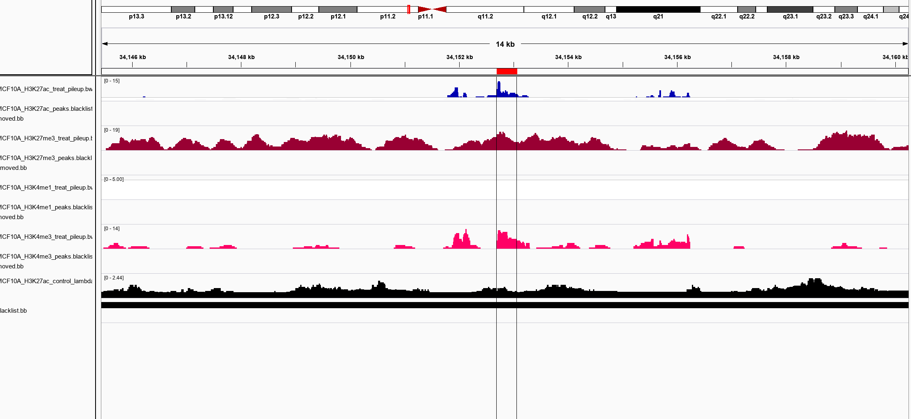
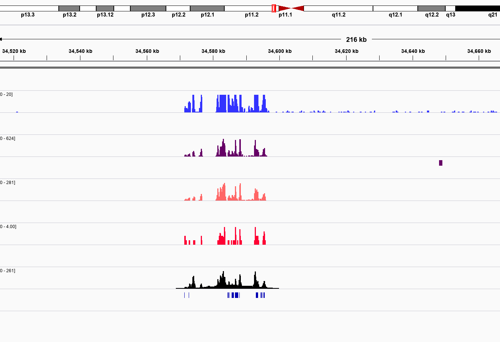
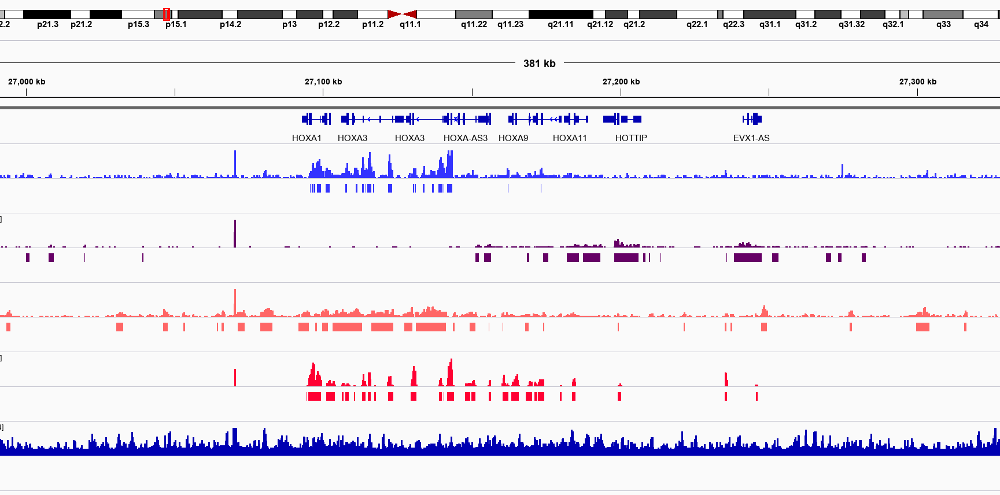

# Module 3

## Lecture

<iframe src="https://drive.google.com/file/d/12MBb3Z_RpFCf6wedS5P8wKd6ZYSW16Jy/preview" width="640" height="480" allow="autoplay"></iframe>

## Lab

### 3. Visualization

#### 3.1 Visualization (Coverage)

Code:
```{}
mkdir -p ~/workspace/{bigBed,bigWig}
sample="MCF10A_H3K27ac"
input_bedgraph=~/workspace/peaks/${sample}_treat_pileup.bdg
output_bigwig=~/workspace/bigWig/${sample}_treat_pileup.bw
chrom_sizes=~/CourseData/EPI_data/Module1/QC_resources/hg38.chrom.sizes
sort -k1,1 -k2,2n ${input_bedgraph} > ~/workspace/bigWig/tmp
bedGraphToBigWig ~/workspace/bigWig/tmp ${chrom_sizes} ${output_bigwig}
rm ~/workspace/bigWig/tmp
```

```{}
input_bedgraph=~/workspace/peaks/${sample}_control_lambda.bdg
output_bigwig=~/workspace/bigWig/${sample}_control_lambda.bw
chrom_sizes=~/CourseData/EPI_data/Module1/QC_resources/hg38.chrom.sizes
sort -k1,1 -k2,2n ${input_bedgraph} > ~/workspace/bigWig/tmp
bedGraphToBigWig ~/workspace/bigWig/tmp ${chrom_sizes} ${output_bigwig}
rm ~/workspace/bigWig/tmp
```

Output:
*N/A*
Code Breakdown:
```{}
mkdir -p ~/workspace/{bigBed,bigWig}
sample="MCF10A_H3K27ac" # Specify variables
input_bedgraph=~/workspace/peaks/${sample}_treat_pileup.bdg #
output_bigwig=~/workspace/bigWig/${sample}_treat_pileup.bw #
chrom_sizes=~/CourseData/EPI_data/Module1/QC_resources/hg38.chrom.sizes #
sort -k1,1 -k2,2n ${input_bedgraph} > ~/workspace/bigWig/tmp  # Sorts peaks as to match alphabetical order in col 1 and numerical in col 2 #$(chrom_sizes) into a temporary file
bedGraphToBigWig ~/workspace/bigWig/tmp ${chrom_sizes} ${output_bigwig} # Conversion step
rm ~/workspace/bigWig/tmp #remove temporary file
```

- **3.2 Visualization (Peaks)**

Code:
```{}
mkdir -p ~/workspace/{bigBed,bigWig}
sample="MCF10A_H3K27ac"
input_bed=~/workspace/peaks/${sample}_peaks.blacklistRemoved.narrowPeak
output_bigbed=~/workspace/bigBed/${sample}_peaks.blacklistRemoved.bb
chrom_sizes=~/CourseData/EPI_data/Module1/QC_resources/hg38.chrom.sizes
cut -f1-3 ${input_bed} | sort -k1,1 -k2,2n  > ~/workspace/bigBed/tmp
bedToBigBed ~/workspace/bigBed/tmp ${chrom_sizes} ${output_bigbed}
rm ~/workspace/bigBed/tmp
```

Output:
*N/A*
Code Breakdown:
```{}
sample="MCF10A_H3K27ac"
input_bed=~/workspace/peaks/${sample}_peaks.blacklistRemoved.narrowPeak
output_bigbed=~/workspace/bigBed/${sample}_peaks.blacklistRemoved.bb
chrom_sizes=~/CourseData/EPI_data/Module1/QC_resources/hg38.chrom.sizes
cut -f1-3 ${input_bed} | sort -k1,1 -k2,2n  > ~/workspace/bigBed/tmp
bedToBigBed ~/workspace/bigBed/tmp ${chrom_sizes} ${output_bigbed} # Largely the same as above, except we trim our narrowPeak file to just 3 columns
rm ~/workspace/bigBed/tmp
```

- **3.3 Visualization**

1. Download tracks via public url
2. Upload onto IGV
2. Explore!

  Comments:

If you’re following via amazon AWS, you should have a public port open to the IPv4 associated with your instance in which you can interact via browser The files you would want to import would be:
```{}
/BigBed//MCF10A_H3K27ac_peaks.blacklistRemoved.bb //bigWig/bigWig/${sample}_treat_pileup.bw /bigWig/${sample}_control_lambda.bw 
```







:::: {.callout type="green" title="Lab Completed!"}

Congratulations! You have completed Lab 3!

::::
